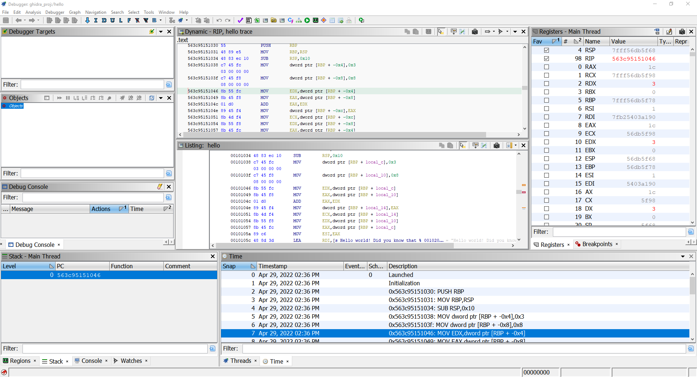
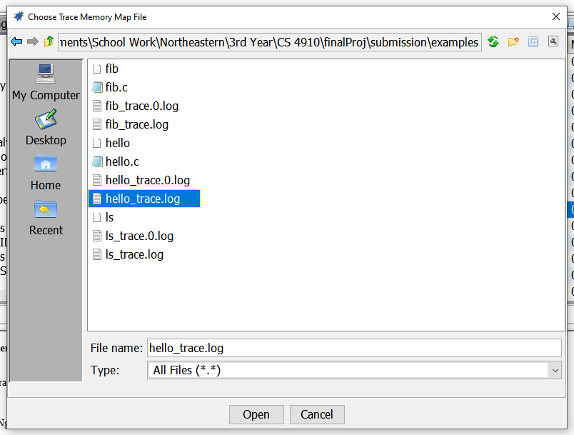

# Creating a Timeless Debugger for Ghidra

[Ghidra](https://ghidra-sre.org/) is wonderful tool for static analysis, but beginning in v10.0, the
NSA released a debugger for Ghidra. Users can connect Ghidra to GDB or WinDbg to use as the
debugger, and Ghidra will display information in its windows about the program as it runs.


A demo of using GDB via Ghidra.

In the debugger tool, there is a "Time" window, which provides "snapshots" of the registers and
memory at different points in execution. Users can click on the different snapshots to see the
state of the registers and memory at the time the snapshot was taken. This tool sounds much like
a timeless debugger, but the downside about the current tool is that it does not necessarily record
the state of every instruction that is executed. Currently, a snapshot is created only at
instructions where execution is suspended.


Ghidra creates snapshots at only points where execution is stopped.

The state of every instruction could be recorded if the user sets a breakpoint at the first
instruction of the program and steps at each instruction. However, this would take a long time.
Let's create a Ghidra script that would allow us to easily display the state for all instructions.

## Building the Timeless Debugger

There are many tools out there that can record a trace of every instruction executed in a program.
[Tenet](https://github.com/gaasedelen/tenet), which is an open-source plugin for IDA Pro, happens
to be a format that traces can be recorded in. The great thing about Tenet is that its format is
very simple: each line represents an instruction that is run and contains a list of registers and
memory locations that has been changed from the previous line, along with the changed values.

With a simple C program as such:

```c
#include <stdio.h>
#include <stdlib.h>

void _start() {
    int a = 3;
    int b = 8;
    int c = a + b;
    printf("Hello world! Did you know that %d + %d = %d?\n", a, b, c);
    exit(0);
}
```

which looks like this in assembly:

```
0000000000001000 <.plt>:
    1000:       ff 35 02 30 00 00       push   QWORD PTR [rip+0x3002]        # 4008 <_GLOBAL_OFFSET_TABLE_+0x8>
    1006:       ff 25 04 30 00 00       jmp    QWORD PTR [rip+0x3004]        # 4010 <_GLOBAL_OFFSET_TABLE_+0x10>
    100c:       0f 1f 40 00             nop    DWORD PTR [rax+0x0]

0000000000001010 <printf@plt>:
    1010:       ff 25 02 30 00 00       jmp    QWORD PTR [rip+0x3002]        # 4018 <printf@GLIBC_2.2.5>
    1016:       68 00 00 00 00          push   0x0
    101b:       e9 e0 ff ff ff          jmp    1000 <.plt>

0000000000001020 <exit@plt>:
    1020:       ff 25 fa 2f 00 00       jmp    QWORD PTR [rip+0x2ffa]        # 4020 <exit@GLIBC_2.2.5>
    1026:       68 01 00 00 00          push   0x1
    102b:       e9 d0 ff ff ff          jmp    1000 <.plt>

0000000000001030 <_start>:
    1030:       55                      push   rbp
    1031:       48 89 e5                mov    rbp,rsp
    1034:       48 83 ec 10             sub    rsp,0x10
    1038:       c7 45 fc 03 00 00 00    mov    DWORD PTR [rbp-0x4],0x3
    103f:       c7 45 f8 08 00 00 00    mov    DWORD PTR [rbp-0x8],0x8
    1046:       8b 55 fc                mov    edx,DWORD PTR [rbp-0x4]
    1049:       8b 45 f8                mov    eax,DWORD PTR [rbp-0x8]
    104c:       01 d0                   add    eax,edx
    104e:       89 45 f4                mov    DWORD PTR [rbp-0xc],eax
    1051:       8b 4d f4                mov    ecx,DWORD PTR [rbp-0xc]
    1054:       8b 55 f8                mov    edx,DWORD PTR [rbp-0x8]
    1057:       8b 45 fc                mov    eax,DWORD PTR [rbp-0x4]
    105a:       89 c6                   mov    esi,eax
    105c:       48 8d 3d 9d 0f 00 00    lea    rdi,[rip+0xf9d]        # 2000 <_start+0xfd0>
    1063:       b8 00 00 00 00          mov    eax,0x0
    1068:       e8 a3 ff ff ff          call   1010 <printf@plt>
    106d:       bf 00 00 00 00          mov    edi,0x0
    1072:       e8 a9 ff ff ff          call   1020 <exit@plt>
```

the Tenet trace would look like this:

```
rdi=0x7fb25403a190,rsi=0x1,rsp=0x7fff56db5f80,rdx=0x7fb254020530,rcx=0x7fff56db5f98,rax=0x1c,r8=0x7fb25403a728,r12=0x563c95151030,r13=0x7fff56db5f80,rip=0x563c95151030,mr=0x7fff56db5f78:ca200154b27f0000,mw=0x7fb25403a4ac:1c
rsp=0x7fff56db5f78,rip=0x563c95151031,mw=0x7fff56db5f78:0000000000000000
rbp=0x7fff56db5f78,rip=0x563c95151034
rsp=0x7fff56db5f68,rip=0x563c95151038
rip=0x563c9515103f,mw=0x7fff56db5f74:03000000
rip=0x563c95151046,mw=0x7fff56db5f70:08000000
rdx=0x3,rip=0x563c95151049,mr=0x7fff56db5f74:03000000
rax=0x8,rip=0x563c9515104c,mr=0x7fff56db5f70:08000000
rax=0xb,rip=0x563c9515104e
rip=0x563c95151051,mw=0x7fff56db5f6c:0b000000
rcx=0xb,rip=0x563c95151054,mr=0x7fff56db5f6c:0b000000
rdx=0x8,rip=0x563c95151057,mr=0x7fff56db5f70:08000000
rax=0x3,rip=0x563c9515105a,mr=0x7fff56db5f74:03000000
rsi=0x3,rip=0x563c9515105c
rdi=0x563c95152000,rip=0x563c95151063
rax=0x0,rip=0x563c95151068
rsp=0x7fff56db5f60,rip=0x563c95151010,mw=0x7fff56db5f60:6d1015953c560000
rip=0x563c95151016,mr=0x563c95154018:161015953c560000
rsp=0x7fff56db5f58,rip=0x563c9515101b,mw=0x7fff56db5f58:0000000000000000
rip=0x563c95151000
rsp=0x7fff56db5f50,rip=0x563c95151006,mr=0x563c95154008:90a10354b27f0000,mw=0x7fff56db5f50:90a10354b27f0000
rdi=0x0,rsi=0x563c952f4260,rsp=0x7fff56db5f68,rdx=0x7fb23f5b18c0,rcx=0x0,rax=0x2b,r8=0x0,r9=0x7fb23f52f7d0,r11=0x7fb23f57e4a0,rip=0x563c9515106d,mr=0x7fff56db5f60:6d1015953c560000,mw=0x7fb23f5b18c0:00000000
rip=0x563c95151072
rsp=0x7fff56db5f60,rip=0x563c95151020,mw=0x7fff56db5f60:771015953c560000
rip=0x563c95151026,mr=0x563c95154020:261015953c560000
rsp=0x7fff56db5f58,rip=0x563c9515102b,mw=0x7fff56db5f58:0100000000000000
rip=0x563c95151000
rsp=0x7fff56db5f50,rip=0x563c95151006,mr=0x563c95154008:90a10354b27f0000,mw=0x7fff56db5f50:90a10354b27f0000
```

Squinting at the trace, we can see that the first line initializes several registers and addresses
in memory. On the second line, we see that `RSP` is set to a value in the stack, and a value is
written to memory. These changes match the first instruction of our assembly program `PUSH RBP`.
Comparing the rest of the trace to the assembly program, we can see the order in which the
instructions were executed.

To get obtain a trace, Tenet suggests several [tracers](https://github.com/gaasedelen/tenet/tree/master/tracers),
including ones based off of [Intel Pin](https://github.com/gaasedelen/tenet/tree/master/tracers/pin),
[QEMU](https://github.com/gaasedelen/tenet/tree/master/tracers/qemu),
[PANDA](https://github.com/AndrewFasano/tenet_tracer), and a
[fuzzer](https://github.com/0vercl0k/wtf). I ended up using the Intel Pin tracer since it is simple
to use, and it works.

Once we have our trace file, we need to parse it and populate the Ghidra windows with the
necessary info:
1. Time window table needs to be populated with snapshots - one for each instruction executed.
2. Dynamic window needs to be populated with the instructions in memory, just like the Listing view.
3. Registers window needs to be populated with the values of the registers at each snapshot.
4. Values in memory can also be updated, but I have not been able to find a window in Ghidra that
will show me a view of memory.


The location of the windows that we will have to fill in with our Tenet trace.

Now that we have our work set out, how do we make a Ghidra script that will fill in our windows?

Looking through the example scripts that Ghidra provides, it looks like one of them is a
[demo](https://github.com/NationalSecurityAgency/ghidra/blob/fdd3a641ea6910378199b760695dfd467949fe22/Ghidra/Debug/Debugger/ghidra_scripts/PopulateDemoTrace.java)
of populating the windows with a hard-coded example trace, which is almost what I want. There is
also a guy who, like me, wanted to add a timeless debugger to Ghidra, so he made a
[post](https://github.com/NationalSecurityAgency/ghidra/discussions/2730) and wrote some
[code](https://github.com/Tim---/ghidra-qira-traceloader/blob/master/PopulateTraceQiraCompatible.java).
He uses [Qira](https://qira.me/), which is a different trace format. I never could get his code to
work, but looking at the code is good inspiration. Ghidra also has pretty good
[JavaDoc](https://ghidra.re/ghidra_docs/api/index.html), which would come in handy, except for the
fact that Ghidra's debugger is so new that it does not yet have any JavaDoc, so I stared at the
[source code](https://github.com/NationalSecurityAgency/ghidra/tree/master/Ghidra/Debug) when
dealing with debugger-related classes.

With these resources in hand, I set out to write my script.

The first thing that I want to do is to be able to create a snapshot for each instruction. This can
be easily done by looping over each line of the trace, and running:

```java
try (UndoableTransaction tid = UndoableTransaction.start(trace, "Step", true)) {
  // do stuff
}
```

Inside this try statement, we can make changes to the registers or memory using either the
`TraceMemoryRegisterSpace.putBytes()` or `TraceMemoryManager.putBytes()` functions, respectively.

We want each snapshot in the "Time" window to be labeled with the instruction to make it easy to
tell which instruction a snapshot represents. The Tenet traces do not tell us what the instructions
are, but Ghidra does in the Listing view.


Listing View, where we can retrieve assembly instructions.

We can match each line of the Tenet trace to an instruction in Ghidra, but the instruction ranges
(program counters) are different. Fortunately, when Intel Pin generated the trace, it also came with
a different file that contained a memory map:

```
White-listing image: hello
Loaded image: 0x563c95150000:0x563c9515202f -> hello
Loaded image: 0x7fb254011000:0x7fb2540373db -> ld-linux-x86-64.so.2
Loaded image: 0x7fff56dd4000:0x7fff56dd4fea -> [vdso]
Loaded image: 0x7fb23f3f4000:0x7fb23f5b47ff -> libc.so.6
```

We can see that `0x563c95150000` is the base address of the Tenet trace. We can also get the base
address of our program in Ghidra by using the Ghidra API, which gives us `0x100000`. We now do some
math and convert the Ghidra addresses into the addresses used by the trace (this is so that
absolute addresses will use trace and not Ghidra addresses). Once the Listing view uses trace
addresses, we can get the instructions using the program counters in the Tenet trace (the program
counters in the Tenet trace are one instruction off, so we need to take that into account). With
the instructions in hand, we can label our snapshots.

We now have our snapshots, registers, and memory populated. The final step is to populate our
Dynamic view, so that users can see the location in memory of the instruction being executed.
Dynamic view is basically like a copy of Listing view. However, I could not seem to find a method
to make a copy of the address space of Listing view, so I took each instruction in Listing view
and reassembled it into Dynamic view. I also copied over function names and labels as well. Dynamic
view is now complete, and the last thing to do is to convert the addresses in Listing view back to
the original Ghidra addresses.



The three views filled in with info.

# Usage

1. [Install Ghidra](https://ghidra-sre.org/InstallationGuide.html).
2. Place the timeless debugger [Ghidra Script](src/PopulateTraceTenet.java) in a directory that your
instance of Ghidra indexes.
3. Create a trace of a program with [Intel Pin](https://github.com/gaasedelen/tenet/tree/master/tracers/pin).
Following Intel Pin's usage directions, two files should be produced: trace.0.log, which contains
the Tenet trace, and trace.log, which contains the memory map.
4. Import the binary that was traced with Intel Pin into Ghidra.
5. Open the binary in Debugger view.
6. Run the PopulateTraceTenet.java script, and select the trace and memory map files.
7. The screen should show the trace. See the images below for a demo. There are also example
programs, binaries, and traces located in the [examples](examples/) directory.


Open the debugger view. Right click on your imported program > Open With > Debugger


Open the script manager by clicking the green play button in the top toolbar.


Run the PopulateTraceTenet.java script. If you do not see it, make sure it is located in a directory
that your instance of Ghidra indexes.


Make sure that the program you want to analyze is open in the Listing View.


Open the Tenet trace file produced by Intel Pin.



Open the memory map produced by Intel Pin.

Now wait for the script to run.


You can now scroll around the Time View to see the program at different execution states.

## Limitations

It seems that Ghidra's tracer will work only with smaller traces. Running the `ls` command yielded
tens of thousands of instructions executed, which did not bode well with Ghidra. It took a very
long time to import the trace, and once it did import, the Ghidra UI was very slow. This seems to be
an internal Ghidra issue with its tracer.

## Related work
* [Qira version of what I did](https://github.com/Tim---/ghidra-qira-traceloader/blob/master/PopulateTraceQiraCompatible.java) - I could not actually get it to work
* [Tenet](https://github.com/gaasedelen/tenet) - The trace format I used, originally made for IDA
Pro
* Four tracers that use Tenet format:
  * [Intel Pin](https://github.com/gaasedelen/tenet/tree/master/tracers/pin)
  * [QEMU](https://github.com/gaasedelen/tenet/tree/master/tracers/qemu)
  * [PANDA](https://github.com/AndrewFasano/tenet_tracer)
  * [fuzzer](https://github.com/0vercl0k/wtf)
* [Qira](https://qira.me/) - Another trace format and tracer
